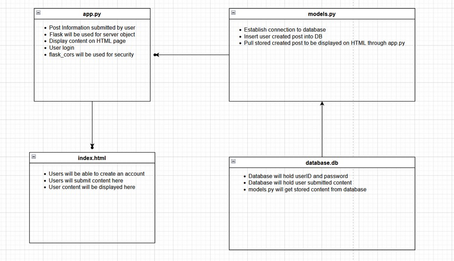

# Project Overview
## Social Media Website
 

## 2 - Introduction Provide an overview of the proposed web application, including its purpose and objectives.

### The service operates as a social media platform, allowing users to create accounts, make posts with attached text and media, interact with other users’ posts, and message other users. Users can follow other users and view a record of followed activity that they have not yet viewed.
 

## 3 - Problem Statement Identify the problem that the proposed web application will solve, and explain why it's important to solve this problem.

### People are naturally social creatures, and want to interact with each other in a convenient way. Since people often cannot meet in person, or live far away from each other, our service allows them to socialize and share media conveniently and remotely.
 

## 4 - Target Audience Identify the target audience for the web application, including their needs and requirements.

### The target audience for the social media platform could be any user looking for a website to share their content. The platform’s purpose is to be a place where users can post images, statuses, and have other users interact with said posts. A user should be able to create an account with a unique ID and password. They should also be able to create a post either fully text or with an image.
 

## 5 - Requirements: Describe the functional and non-functional requirements for the web application. Include a list of the key features and explain how they will work. Consider including block diagrams to help visualize the application. (You don’t need to create user story at this point)

### User registration and authentication, posting text and images. Profile management, some kind of feedback system to post (upvote, like dislike, share, comment, etc), user and post search and a follow/friend request option. Security, usability and performance.
 

## 6 - Software Architecture: Describe the software architecture of the web application. Include a block diagram showing the major components of the application and how they interact with each other. Describe the role of each component and how they work together to meet the requirements of the application.

 

## 7 - Technology Stack Describe the technology stack that will be used to develop the web application, including frontend and back-end technologies, frameworks, libraries and database.

### The application will run in Python, using Flask to host a web server. The following python modules will be used:

sqlalchemy, flask-sqlalchemy, pymysql - SQL Database Management

cryptography - Encryption of sensitive information.
 

## 8 - Team Members Introduce your team member.

Micah Lasala - 2nd-year Junior at UNCC majoring in Computer Science.

George Viveros-Zavaleta

Colin Childers - Senior at UNCC majoring in  Comp Science

Ryan Lowell - Junior at UNCC majoring in Computer Science

 Steve Andreas - Senior at UNCC majoring in Comp Science
